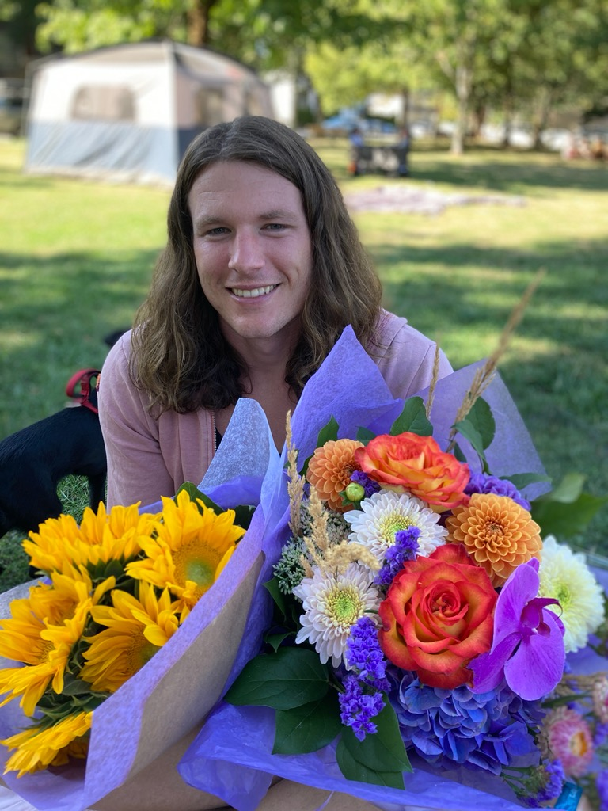

# GEOS 270: Geographic Information Science
{: .no_toc }

  

    Table of contents
  

  {: .text-delta }
1. TOC
{:toc}

---

# Learning Outcomes

This course will introduce you to key concepts and tools used to collect, map, and interpret geographic data.  We will learn how geospatial data can be used to aid decision-making, complement scientific analysis, assist with urban planning, and help inform policy-making.  You will gain practical experience using geospatial data to solve problems in both the natural and human realms.  This term we will cover:

* How GIS functions and how it can be applied to solve problems.
* How phenomena are represented as geospatial data in a GIS.
* How to implement geospatial analysis methods.
* Visualizing geospatial data and principles of good map design. 
* Sources of error in GIS analysis and output.
* The ethical implications of GIS analysis.
* GIS workflows and collaborating to complete a GIS project.

---

# Your Instructor:

| Name | Dr. June Skeeter |
| Pronouns | They/Them/Theirs |
| Email | june.skeeter@ubc.ca |
| Office | Room 144, Geography Bldg. |
| Office Hours| Wednesdays 10:00-10:50 + 12:30-14:00 Friday 11:00-14:00  Or [on zoom](https://ubc.zoom.us/j/66359522453?pwd=ZzZUMzV3NVY1V3pzcmYzZFBadW93UT09) *by appointment, at least 24hrs notice required* |

My name is June.  I am a non-binary geographer, researcher, and educator who has been living as an uninvited guest on unceded Coast Salish Territory since 2015.  I have been teaching GEOS 270 since 2020.  If you'd like to know what previous 270 students have thought of my course, you can find my [Past teaching evaluations here](https://github.com/GEOS270/Syllabus/tree/main/docs/Evaluations).

I am passionate about teaching Geographic Information Science and using Geographic Information Systems as a tool to address social and ecological justice issues.  My principal aim this semester is to provide a holistic introduction to the study of Geographic Information Science and application of Geographic Information Systems.  I use GIS extensively is my research on climate change in the wetland ecosystems.

* I also work as a Postdoc for the [UBC Micrometeorology Lab](https://blogs.ubc.ca/saraknox/).  We study carbon balances in wetland ecosystems in the Metro Vancouver area.
  * If anyone is interested in micrometeorology and/or climate science, don't hesitate to reach out!

  <iframe src="https://ubc-micromet.github.io/FieldSiteMaps/" title="Processes" scrolling="no" frameborder="0"
    style="border: 0;
   height: 100%;
   left: 0;
   position: absolute;
   top: 0;
   width: 100%;">
   
Your browser does not support iframes.

 </iframe>

---

# Your TAs

| Name | Zijie Chai |
| Pronouns | She/Her/Hers |
| Email | zijie01@mail.ubc.ca |
| Office | Room 225, Geography Bldg. |

My name is Zijie and I am a MSc student in Geography, studying the Contributions of glaciers to streamflow and how they have varied in response to climatic variability and glacier changes in Columbia River Basin. My background has mostly been focused on hydrology, a little on Hydrogeology and Biohydrology. In my free time I enjoy hiking, SUP, travelling, trying new food and watching movies!

| Name | Nastaran Pournematollahi |
| Pronouns | She/Her/Hers |
| Email | nasipour@student.ubc.ca |
| Office | Room 114, Geography Bldg. |

My name is Nastaran Nematolahi, and I am a second-year Ph.D. student in Geography. I am a physical geographer with a strong interest in river morphodynamics and environmental hydraulics. My research focuses on alluvial fans and the processes that operate on them. I also have a Master's degree in Hydraulic Structures, which has given me a diverse background in the field. In my free time, I enjoy dancing and ice skating

