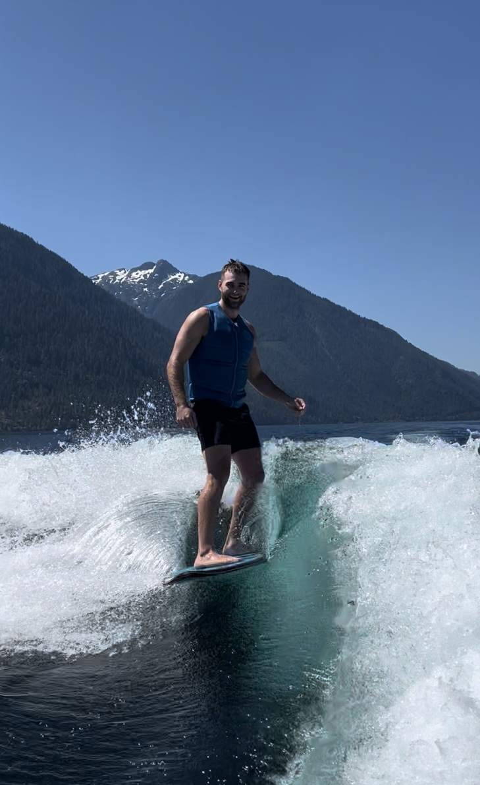
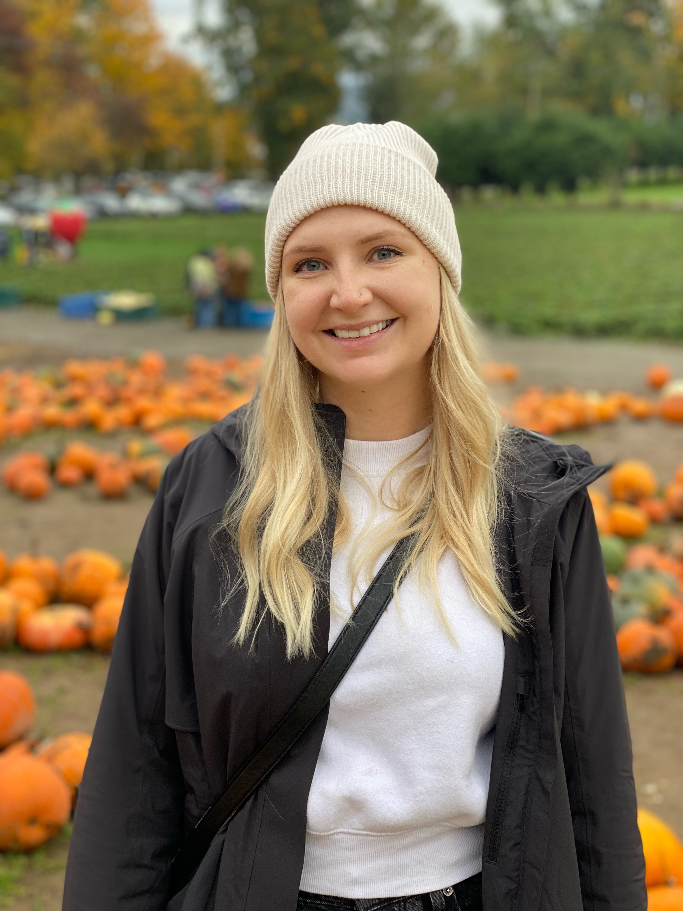

# GEOS 270: Geographic Information Science
{: .no_toc }

  

    Table of contents
  

  {: .text-delta }
1. TOC
{:toc}

---

# Learning Outcomes

This course will introduce you to key concepts and tools used to collect, map, and interpret geographic data.  We will learn how geospatial data can be used to aid decision-making, complement scientific analysis, assist with urban planning, and help inform policy-making.  You will gain practical experience using geospatial data to solve problems in both the natural and human realms.  This term we will cover:

* How GIS functions and how it can be applied to solve problems.
* How phenomena are represented as geospatial data in a GIS.
* How to implement geospatial analysis methods.
* Visualizing geospatial data and principles of good map design. 
* Sources of error in GIS analysis and output.
* The ethical implications of GIS analysis.
* GIS workflows and collaborating to complete a GIS project.

---

# Your Instructor: June Skeeter

| Pronouns | They/Them/Theirs |
| Email | june.skeeter@ubc.ca |
| Office | Room 144, Geography Bldg. |
| Office Hours| Tuesdays/Thursdays **After** lecture 14:00-15:00   Or [on zoom](https://ubc.zoom.us/j/66359522453?pwd=ZzZUMzV3NVY1V3pzcmYzZFBadW93UT09) *by appointment* |

My name is June and I am a non-binary geographer, researcher, and educator.  I have been living as an uninvited guest on unceded Coast Salish Territory since 2015 and will be receiving a PhD in Geography from the University of British Columbia in Fall 2022.

I have been teaching GEOS 270 since 2020.  I am passionate about teaching Geographic Information Science and using Geographic Information Systems as a tool to address social and ecological justice issues.  My principal aim this semester is to provide a holistic introduction to the study of Geographic Information Science and application of Geographic Information Systems.  When I'm not working, I like to spend my free time hiking, gardening, foraging, and going to drag shows.  

I use GIS extensively is my research on climate change in the wetland ecosystems.

* For my PhD, I studied greenhouse gas exchange remote [Arctic Ecosystems](https://cdnsciencepub.com/doi/full/10.1139/as-2021-0034).  
* Now I am working for the [UBC Micrometeorology Lab](https://blogs.ubc.ca/saraknox/).  We study carbon balances in wetland ecosystems in the Metro Vancouver area.
  * If anyone is interested in micrometeorology and/or climate science, don't hesitate to reach out!

  <iframe src="https://ubc-micromet.github.io/FieldSiteMaps/" title="Processes" scrolling="no" frameborder="0"
    style="border: 0;
   height: 100%;
   left: 0;
   position: absolute;
   top: 0;
   width: 100%;">
   
Your browser does not support iframes.

 </iframe>

---

# Your TAs

## Landen Matechuk 

| Pronouns | He/Him/His |
| Email | landenm@student.ubc.ca |
| Office | Room 246, Geography Bldg. |

My name is Landen, and I am an MSc student in geography, studying channel response to the loss of riparian vegetation and beaver habitats in British Columbia. My research background has focused on applying GIS, and remote sensing technologies to various topics focused on watershed productivity and health. When I am not studying or working, I am most likely hiking, snowboarding, surfing, or reading.

## Sierra Collins 

| Pronouns | She/Her/Hers |
| Email | sierraco@mail.ubc.ca |
| Office | Room 114, Geography Bldg. |

My name is Sierra and I am a MSc student in Geography, studying the effects of snowmelt on stream temperatures in the southern Coast Mountains of BC. My background has mostly been focused on hydrology in the Pacific Northwest, but I also have spent some time working in biology and conservation. In my free time I enjoy hiking, kayaking, travelling, trying new food and reading!

